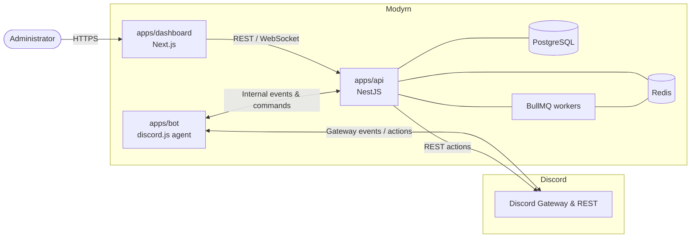

# Architecture

Modyrn is a **self-hosted moderation platform**. The Discord bot is an agent; the
dashboard is the product. This document describes how the pieces fit together.

## System overview

## Components

### apps/dashboard — the product

A Next.js (App Router) application. Server components fetch data from the API;
client components handle interactivity and realtime updates. Styled with Tailwind
CSS and shadcn/ui, dark mode first.

Responsible for **all configuration**. No configuration happens through Discord
slash commands.

### apps/api — the brain

A NestJS application exposing a REST + WebSocket API. Owns:

- Authentication (Discord OAuth2) and dashboard permission model
- Persistence via Drizzle ORM
- The automod rule engine
- Job scheduling via BullMQ (scheduled messages, temp bans, quarantine expiry…)
- Realtime fan-out to the dashboard
- Issuing moderation actions to Discord via REST

### apps/bot — the agent

A discord.js gateway client. It:

- Receives gateway events and forwards normalized events to the API
- Registers and handles the minimal set of slash commands (immediate actions)
- Executes gateway-only operations the REST API can't perform

The bot holds **no business logic** for configuration; it defers to the API.

### packages/database

Drizzle ORM schema, migrations, and a typed client. Shared by the API (and any
worker) so there is a single source of truth for the data model.

### packages/shared

Framework-agnostic types, enums, constants and Zod schemas shared across the
dashboard, API and bot. This keeps the contract between processes type-safe.

### packages/ui

A shared shadcn/ui-based component library so the dashboard and any future
surfaces share a consistent design system.

## Data flow example: a `/ban` command

1. Moderator runs `/ban` in Discord.
2. The bot receives the interaction and calls the API.
3. The API validates dashboard permissions, writes a **case**, enqueues a job.
4. A worker performs the Discord REST ban and records the audit trail.
5. The API emits a realtime event; the dashboard timeline updates live.

## Progressive complexity

The dashboard exposes three modes — **Simple**, **Advanced**, **Expert** — stored
per-guild. Feature surfaces read this setting to decide how much configuration to
reveal, so small servers stay simple while large communities get full power.

## Scaling

- Stateless API and bot processes scale horizontally.
- Redis provides caching, rate limiting, pub/sub and the job queue backend.
- Heavy or delayed work (bulk moderation, scheduled sends, expiries) runs on
  BullMQ workers rather than blocking request handlers.
